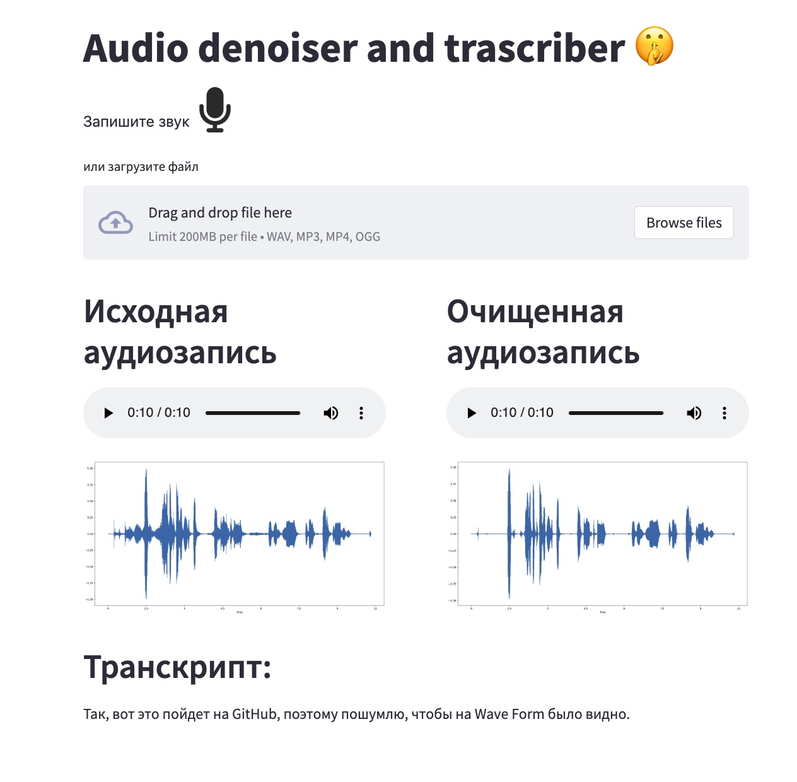

# Web speech denoiser and transcriber

### Структура проекта:
```
.
├── app # веб и live приложения
├── doc # оформление репозитория
└── wave_wizard # модели, обучение, тестирование и т.д.
```

Подробности обучения: wave_wizard/README.md
Подробности по запуску веб приложения и real-time плагина app/README.md

Инструкция по запуску:
```
git clone https://github.com/sir-timio/web-denoiser.git
cd web-denoiser
pip install -r full_requirements.txt 
```

### generate train data

- download/get clean and noise audio files. Used data: https://github.com/microsoft/MS-SNSD:
    ```
    git clone https://github.com/microsoft/MS-SNSD
    mv MS-SNSD/noise_train wave_wizard/noise_train
    mv MS-SNSD/noise_train wave_wizard/clean_train
    ```
- optional: add to clean_data some subsets from https://github.com/snakers4/open_stt/#links with 99%+ quality
- generate train data, split it into train, val and test as you wish, but test metrics take a lot of time
    ```
    cd wave_wizard
    python noiser.py --config configs/noiser_config.yaml
    ```
- run training, check metrics and debug samples
    ```
    python train.py --config configs/train_config.yaml
    ```
- create app/.env file with variables
    ```
    STORAGE_FOLDER=<YOUR STORAGE FOLDER>
    DENOISER_V=dns64
    WHISPER_V=base # from pip install git+https://github.com/openai/whisper.git 
    ```
- lauch app
    ```
    streamlit run app/app.py
    ```

