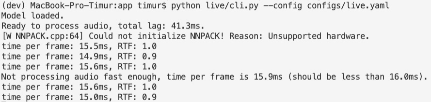
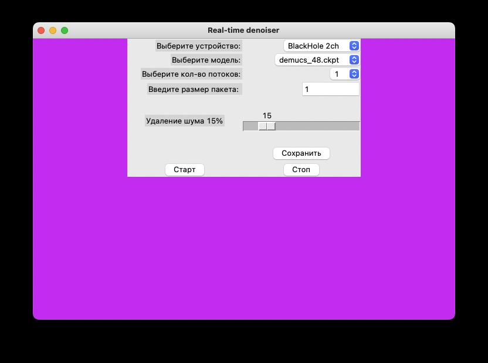
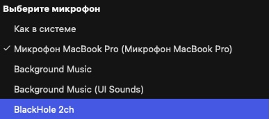

load checkpoints into app/weights 

[demucs_48](https://drive.google.com/file/d/1B19wLh2YmVjElHhlAI1kAkPWFZ7zyRZM/view?usp=share_link)

[demucs_64](https://drive.google.com/file/d/1B19wLh2YmVjElHhlAI1kAkPWFZ7zyRZM/view?usp=share_link)

for both web and live, specify yaml config in configs/

On mac os, install [BlackHole](https://github.com/ExistentialAudio/BlackHole) first.

# live cli
```
    python live/cli.py --config configs/live.yaml
```




# live gui
```
    python live/gui.py
```




Нажми кнопку сохранить для обновления параметров запуска.

Выберите в качестве микрофона нужное устройство.


# web

Можно запустить как с исходников:
```
    streamlit run web/app.py -- --config configs/web.yaml
```

так и через docker:
```
    sh build.sh
    sh up.sh
```

Для линукса необходимо в web/up.sh добавить передачу [устройства](https://stackoverflow.com/questions/45700653/can-my-docker-container-app-access-the-hosts-microphone-and-speaker-mac-wind). 
Для macos я воспользовался [pulseaudio](https://stackoverflow.com/questions/40136606/how-to-expose-audio-from-docker-container-to-a-mac)

Свободно меняйте entrypoint в Dockerfile, чтобы докеризовать другой сервис!


