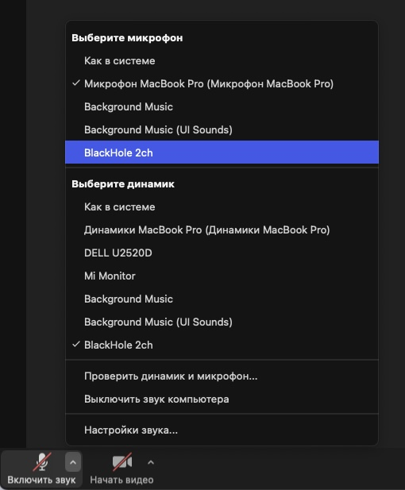

load checkpoints into app/weights 

[demucs_48](https://drive.google.com/file/d/1B19wLh2YmVjElHhlAI1kAkPWFZ7zyRZM/view?usp=share_link)

[demucs_64](https://drive.google.com/file/d/1B19wLh2YmVjElHhlAI1kAkPWFZ7zyRZM/view?usp=share_link)

for both web and live, specify yaml config in configs/

On mac os, install [BlackHole](https://github.com/ExistentialAudio/BlackHole) first.

# live cli
```
    python live/cli.py --config configs/live.yaml
```


# live gui
```
    python live/gui.py
```


Нажми кнопку сохранить для обновления параметров запуска.

Выберите в качестве микрофона нужное устройство.



# web
```
    streamlit run web/app.py -- --config configs/web.yaml
```

