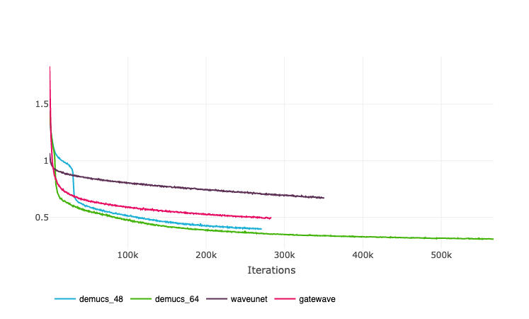
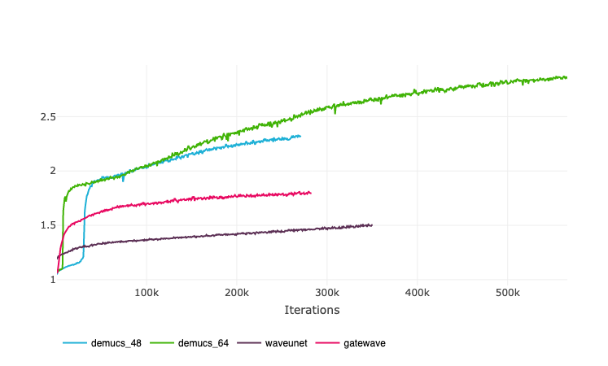
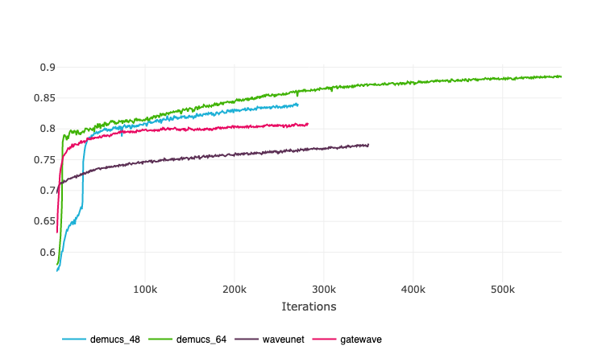
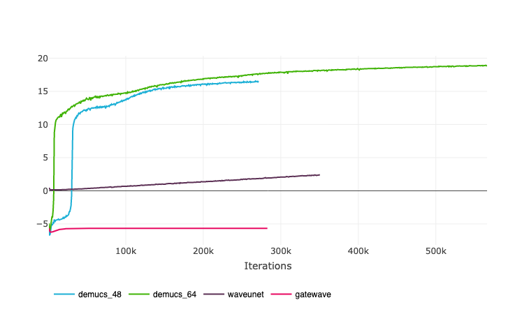
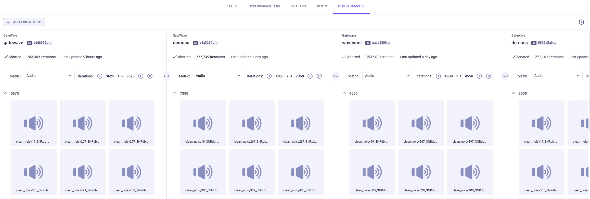
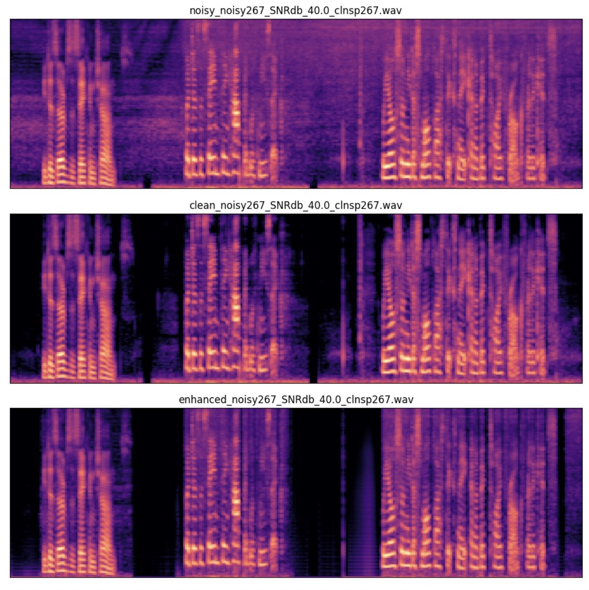
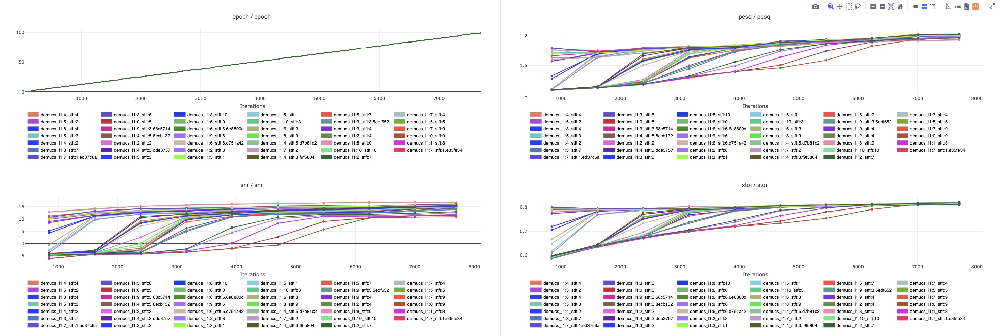
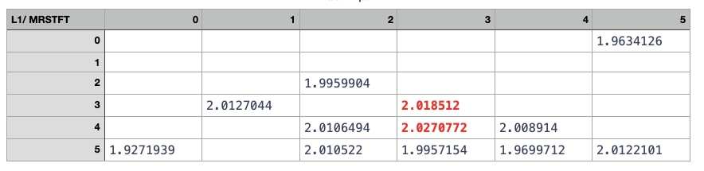

# Краткий отчет о проведенных эксприментах:

В настоящее время, существуют модели на основе STFT представления, WAV представления и их комбинации. В данном проекте рассматривались архитектуры, основанные на wave-форме без перехода stft-istft, позволяющие достичь высокой скорости обработки даже на CPU и работать real-time. В качестве функции потерь использовалась комбинация L1 и multiresolution STFT потерь, реализация взята из Demucs.

Реализация моделей, цикла обучения представлена в директории wave_wizard.
Было реализованно 3 варианта архитектуры: Wave-Unet и [Demucs](https://github.com/facebookresearch/denoiser) взято практически без изменений, Wave-Unet адаптированно со [статьи](https://arxiv.org/pdf/1806.03185.pdf) и  GateWave - собственная разработка, вдохновленная [статьей](https://paperswithcode.com/method/gated-convolution-network). (Позднее оказалось, что данная идея присутсвует и в demucs при параметре [glu](https://pytorch.org/../docs/stable/generated/torch.nn.GLU.html) (Gated Linear Unit), отвечающим за функцию активации, что объясняет четный рост размерности: вторая половина матрицы представляет из себя 'маску')

В качестве фреймворка для трекинга экспериментов был выбран [CleaML](https://clear.ml/) в связке с [Tensorboard](https://pytorch.org/../docs/stable/tensorboard.html). Он удовлетворяет всем необходимым потребностям для данного эксперимента: треккинг метрик, дебаг вывод аудио и изображений, вывод загруженности гпу и процессора, совместимость с pytorch_lightning. Модели реализованы на [Pytorch](https://pytorch.org/), цикл обучения на [Pytorch_Lightning](https://www.pytorchlightning.ai/index.html), рассчет метрик с помощью [TorchMetrics](https://torchmetrics.readthe../docs.io/en/stable/)

Гиперпараметры взяты из статей, для GateWave подбирались по аналогии с WaveUnet и Demucs.
Описание обработки данных, цикла обучения и генерации представлено в задокументированном коде и конфигурационных файлах.

Краткое описание цикла обучения:
 - Загрузка чистых аудиозаписей и шума;
 - Комбинация чистых аудиозаписей и шума с различным соотношением, аугментации;
 - Старт обучения модели;
 - Логгирование лосса, вывод изображений и обратанных аудио раз в n эпох, рассчет метрик (stoi, pesq, snr).
 - Сохранение модели для инференса


## Структура wave_wizard:
```
.
├── blocks # реализация кастомных блоков для GateWave
│   ├── basic.py
│   └── gated.py
├── callbacks.py # pytorch_ligthing callbacks для визуализации процесса обучения (дебаг аудио, изображений)
├── dataset.py # обработка данных, dataloaders
├── inference.py # инференс модели
├── loss.py # stft лосс из demucs
├── models # реализация моделей, описанных выше
│   ├── demucs.py
│   ├── gatewave.py 
│   ├── util.py # полезные модели
│   └── waveunet.py
├── noiser.py # модуль по генерации пар данных сигнал - зашумленный сигнал
├── util.py
└── wrap.py # обертка pytorch_ligthing
```

## Метрики и потери
Ниже приведены графики метрик и потерь в процессе обучения 4 моделей: классического wave-unet, demucs_48, demucs_64, gatewave. Каждая из них по своему влиет на данные, что можно услышать в debug samples. Эмпирические наблюдений: gatewave и wave-unet не убирает шум с голоса с первым эпох, сперва старается убрать шум в паузах. Demucs ведет себя соверешнно иначе и с первых эпох превращает сигнал в однородный звук, а голос будто пытается синтезировать. (можно послушать сравнение gatewave и demucs 64 на тысячной эпохе в ../doc/audio, где заметны артефакты demucs)

L1 + Multiresolution STFT loss. Меньше - лучше, минимум - 0.

### Формула:

Loss(x, y) = $\alpha$ L1(x, y) + $\beta$ MultiResolutionSTFTLoss(x, y),

где
MultiResolutionSTFTLoss = [STFTLoss(fs, ss, wl, window)] при 

fs = 512, 1024, 2048 - размер быстрого преобразования Фурье

ss = 50, 120, 240 - размер скачка

window = 240, 600, 1200 - размер окна

соотвественно

### сравнение архитектур при значениях $\alpha$ = 1, $\beta$ = 1



Perceptual Evaluation of Speech Quality (PESQ).

Методика тестирования для автоматической оценки качества речи, воспринимаемого пользователем телефонной системы.
PESQ используется для объективного тестирования качества голосовой связи производителями телефонов, поставщиками сетевого оборудования и операторами связи. Больше - лучше, значения от -0.5 до 4.5.



Short-Time Objective Intelligibility (STOI).

Показатель разборчивости, который сильно коррелирует с ухудшеннием речевых сигналов, например, из-за аддитивного шума, одноканального/многоканального шумоподавления. Больше - лучше, значения от 0 до 1.



Signal-to-noise ratio (SNR).

Рассчитывается как отношение мощности сигнала к мощности шума. Больше - лучше. значения от 0 до inf. При создании датасета можно проконтролировать snr, следовательно, установить предел snr. В данных экспериментах использовалось в среднем snr = 20.




Пример вывода аудиозаписей в ходе обучения




Количество эпох обучения для demucs 64 больше, поскольку, как наиболее успешную модель, я решил ее дообучить больше.

### сравнение значений $\alpha$ и $\beta$ при обучении demucs 48 100 эпох с помощью optuna


табличное сравнение метрики pesq - целевой для optuna



Как видно из таблицы, метрика показывает лучший результат при комбинированном сбалансированном лоссе с коэф. около 1/1.
